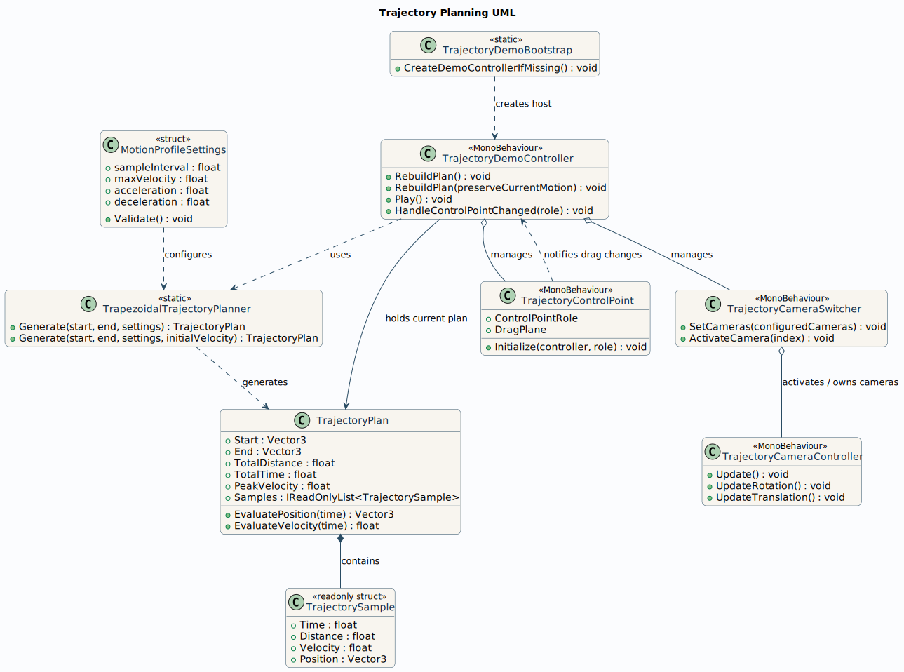

# Trajectory Planning Assignment

Unity C# solution for generating a path from start to end using a trapezoidal velocity profile, with a runtime demo that visualizes the generated path, animates a cube along it, and supports discrete replanning when the goal changes.

## What is included

- Runtime planner in [Assets/Scripts/TrajectoryPlanning/TrapezoidalTrajectoryPlanner.cs](Assets/Scripts/TrajectoryPlanning/TrapezoidalTrajectoryPlanner.cs)
- Demo scene controller in [Assets/Scripts/TrajectoryPlanning/TrajectoryDemoController.cs](Assets/Scripts/TrajectoryPlanning/TrajectoryDemoController.cs)
- Edit mode unit tests in [Assets/Tests/EditMode/TrapezoidalTrajectoryPlannerTests.cs](Assets/Tests/EditMode/TrapezoidalTrajectoryPlannerTests.cs)
- UML image in [uml_diagram.svg](uml_diagram.svg)

## Project structure

- `Assets/Scripts/TrajectoryPlanning`
  Runtime code for the motion profile, generated samples, and demo playback.
- `Assets/Tests/EditMode`
  NUnit edit mode tests for the trajectory generator.
- `Packages/manifest.json`
  Minimal package manifest that includes Unity Test Framework.

## How the planner works

1. Compute the segment length from `Start` to `End`.
2. Determine whether the requested profile can reach `maxVelocity`.
3. If yes, build a trapezoidal profile with acceleration, cruise, and deceleration.
4. If not, fall back to a triangular profile with a lower peak velocity.
5. Sample the profile at the requested `sampleInterval` and append the exact endpoint sample.

The planner also supports replanning from a non-zero current speed. The runtime demo uses that when the goal changes during motion, so the cube can continue moving instead of restarting from rest.

In the runtime demo, `sampleInterval` has two roles:

- it controls the spacing of generated trajectory samples
- it also acts as the discrete replanning cadence

If the goal changes during Play Mode, the current path is kept until the next sampling instant. At that instant, a new path is generated from the cube's current state to the actual current goal.

Each sample stores:

- elapsed time
- traveled distance along the segment
- instantaneous scalar velocity
- world position

## How to run in Unity

1. Install Unity Hub on Ubuntu 22.04 and install Unity `6000.3.10f1` (Unity 6.3 LTS).
2. Open this folder as a Unity project.
3. Open any scene and press Play.

The project includes a runtime bootstrapper in [Assets/Scripts/TrajectoryPlanning/TrajectoryDemoBootstrap.cs](Assets/Scripts/TrajectoryPlanning/TrajectoryDemoBootstrap.cs). If no controller exists in the scene, it creates one automatically together with:

- a green start sphere
- a red end sphere
- a yellow cube that moves along the planned path
- a visible path line in the Game view
- runtime drag controls for the start and end spheres
- three switchable 3D cameras

You can also add `TrajectoryDemoController` manually to a GameObject and assign your own `Start`, `End`, and moving object transforms through the Inspector.

## Configurable parameters

The controller exposes these inputs in the Inspector:

- `Start` and `End` transforms
- `sampleInterval`
- `maxVelocity`
- `acceleration`
- `deceleration`
- loop and autoplay flags
- path visibility, color, and width
- runtime drag toggle for the control points
- automatic camera rig creation

## Runtime demo behavior

- The cyan line shows the currently active planned path.
- The yellow cube follows that path with frame-by-frame interpolation between generated samples.
- Moving the red goal does not update the path immediately. The path is regenerated only on the next `sampleInterval`.
- After each replan, the cyan path ends at the current goal position.
- Changing `sampleInterval` affects both path density and how often the demo replans.

## Runtime controls

- Drag the green and red spheres in the Game view to move the start and end points
- Use the runtime GUI panel in the Game view to edit `sampleInterval`, `acceleration`, `deceleration`, and the `Start`/`End` coordinates directly
- Press `1`, `2`, or `3` to switch between the three demo cameras
- Hold right mouse button and move the mouse to rotate the active camera
- Use `W`, `A`, `S`, `D` to move the active camera
- Use `Q` and `E` to move down or up
- Use the mouse wheel to zoom forward or backward

## Running tests

1. Open the Unity Test Runner.
2. Select Edit Mode.
3. Run `TrajectoryPlanning.Tests.EditMode`.

Covered cases:

- zero-distance path generation
- trapezoidal profile generation with cruise phase
- triangular fallback when the segment is too short
- interpolated position lookup
- interpolated velocity lookup
- invalid settings rejection
- exact endpoint preservation even with large `sampleInterval`
- monotonic sample time and distance progression
- bounded velocity values
- replanning with preserved non-zero initial velocity
- initial velocity clamping to `maxVelocity`

## Manual verification

Use Play Mode to verify the scene behavior that is not covered by Edit Mode unit tests:

- drag the end goal and confirm the path only updates on the next `sampleInterval`
- confirm the updated path ends at the actual current goal
- confirm the cube keeps moving during replanning
- confirm GUI edits change the path and motion behavior
- confirm camera switching and drag controls work as expected

## Notes

- This machine did not have Unity or `dotnet` installed, so the repository was prepared to be Unity-compatible but was not executed locally in-editor.
- The committed `ProjectVersion.txt` targets Unity `6000.3.10f1`.
