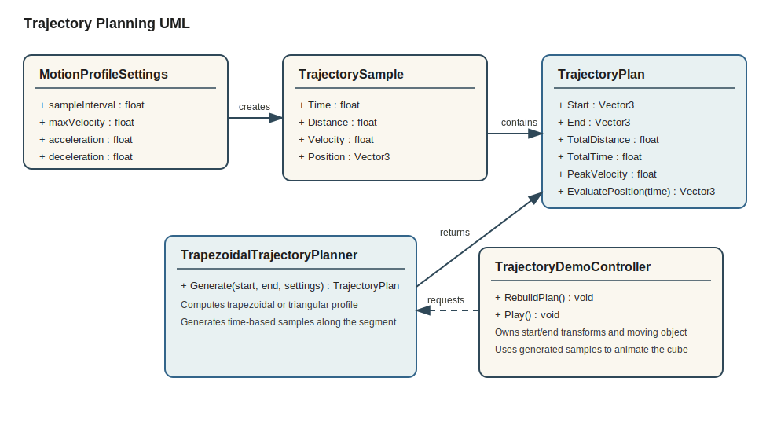

# Trajectory Planning Assignment

Unity C# solution for generating a path from start to end using a trapezoidal velocity profile, with a simple runtime demo that animates a cube along the generated samples.

## What is included

- Runtime planner in [Assets/Scripts/TrajectoryPlanning/TrapezoidalTrajectoryPlanner.cs](Assets/Scripts/TrajectoryPlanning/TrapezoidalTrajectoryPlanner.cs)
- Demo scene controller in [Assets/Scripts/TrajectoryPlanning/TrajectoryDemoController.cs](Assets/Scripts/TrajectoryPlanning/TrajectoryDemoController.cs)
- Edit mode unit tests in [Assets/Tests/EditMode/TrapezoidalTrajectoryPlannerTests.cs](Assets/Tests/EditMode/TrapezoidalTrajectoryPlannerTests.cs)
- UML image in [docs/trajectory-planning-uml.svg](docs/trajectory-planning-uml.svg)

## Project structure

- `Assets/Scripts/TrajectoryPlanning`
  Runtime code for the motion profile, generated samples, and demo playback.
- `Assets/Tests/EditMode`
  NUnit edit mode tests for the trajectory generator.
- `Packages/manifest.json`
  Minimal package manifest that includes Unity Test Framework.

## How the planner works

1. Compute the segment length from `Start` to `End`.
2. Determine whether the requested profile can reach `maxVelocity`.
3. If yes, build a trapezoidal profile with acceleration, cruise, and deceleration.
4. If not, fall back to a triangular profile with a lower peak velocity.
5. Sample the profile at the requested `sampleInterval` and append the exact endpoint sample.

Each sample stores:

- elapsed time
- traveled distance along the segment
- instantaneous scalar velocity
- world position

## How to run in Unity

1. Install Unity Hub on Ubuntu 22.04 and install a Unity 2022.3 LTS editor.
2. Open this folder as a Unity project.
3. Open any scene and press Play.

The project includes a runtime bootstrapper in [Assets/Scripts/TrajectoryPlanning/TrajectoryDemoBootstrap.cs](Assets/Scripts/TrajectoryPlanning/TrajectoryDemoBootstrap.cs). If no controller exists in the scene, it creates one automatically together with:

- a green start sphere
- a red end sphere
- a yellow cube that moves along the planned path

You can also add `TrajectoryDemoController` manually to a GameObject and assign your own `Start`, `End`, and moving object transforms through the Inspector.

## Configurable parameters

The controller exposes these inputs in the Inspector:

- `Start` and `End` transforms
- `sampleInterval`
- `maxVelocity`
- `acceleration`
- `deceleration`
- loop and autoplay flags

## Running tests

1. Open the Unity Test Runner.
2. Select Edit Mode.
3. Run `TrajectoryPlanning.Tests.EditMode`.

Covered cases:

- zero-distance path generation
- trapezoidal profile generation with cruise phase
- triangular fallback when the segment is too short
- interpolated position lookup
- invalid settings rejection

## Notes

- This machine did not have Unity or `dotnet` installed, so the repository was prepared to be Unity-compatible but was not executed locally in-editor.
- The committed `ProjectVersion.txt` targets Unity `2022.3.20f1`.
